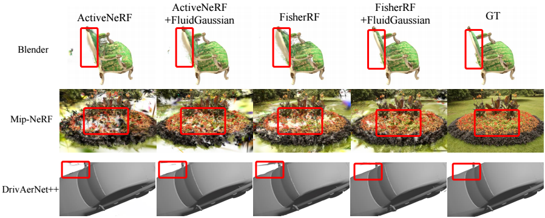

# FluidGaussian: Propagating Simulation-Based Uncertainty Toward Functionally-Intelligent 3D Reconstruction

[](https://arxiv.org/abs/2603.21356)
[](https://arxiv.org/pdf/2603.21356)
[](https://autumnyq.github.io/FluidGaussian/)

[**Yuqiu Liu**](https://autumnyq.github.io/)<sup>1\*</sup>, [**Jialin Song**](https://scholar.google.com/citations?user=-zPtvfsAAAAJ&hl=en)<sup>1\*</sup>, [**Marissa Ramirez de Chanlatte**](https://scholar.google.com/citations?user=ByxEbZEAAAAJ&hl=en)<sup>2</sup>, [**Rochishnu Chowdhury**](https://scholar.google.com/citations?user=DVQjbr4AAAAJ&hl=en)<sup>2</sup>, [**Rushil Paresh Desai**]()<sup>3</sup>, [**Wuyang Chen**](https://www.sfu.ca/fas/computing/people/faculty/faculty-members/wuyang-chen.html)<sup>1</sup>, [**Daniel Martin**](https://scholar.google.com/citations?user=oXfed6oAAAAJ&hl=en)<sup>2</sup>, [**Michael Mahoney**](https://www.stat.berkeley.edu/~mmahoney/)<sup>2,3,4</sup>

<sup>\* Equal contribution</sup>

<sup>1</sup> Simon Fraser University &nbsp;&nbsp; <sup>2</sup> Lawrence Berkeley National Lab &nbsp;&nbsp; <sup>3</sup> University of California, Berkeley &nbsp;&nbsp; <sup>4</sup> International Computer Science Institute





## Installation

### 1. Clone with submodules

```bash
git clone https://github.com/delta-lab-ai/FluidGaussian --recursive
cd FluidGaussian
```

### 2. Install all dependencies

```bash
conda create -n fluigaussian python=3.10 -y
conda activate fluigaussian

pip install -r requirements.txt
pip install -r requirements-ext.txt
```


## Dataset

Download the NeRF-Synthetic dataset:

```bash
pip install gdown
gdown --id 1OsiBs2udl32-1CqTXCitmov4NQCYdA9g -O nerf_synthetic.zip
unzip nerf_synthetic.zip
```

## Running

```bash
# ./run.sh <method> <data_name> <data_dir> <exp_dir>
bash run.sh combine lego /path/to/nerf_synthetic /path/to/exp

# Available selectors:
#   rand           – random baseline
#   H_reg          – FisherRF 
#   variance       – ActiveNeRF 
#   physics        – Pure simulation-based
#   combine_active – ActiveNeRF + FluidGaussian
#   combine        – (Ours) FisherRF + FluidGaussian
```

## Citation

```bibtex
@article{liu2026fluidgaussian,
  title={FluidGaussian: Propagating Simulation-Based Uncertainty Toward Functionally-Intelligent 3D Reconstruction},
  author={Liu, Yuqiu and Song, Jialin and Ramirez de Chanlatte, Marissa and Chowdhury, Rochishnu and Desai, Rushil Paresh and Chen, Wuyang and Martin, Daniel and Mahoney, Michael},
  journal={CVPR},
  year={2026}
}
```
